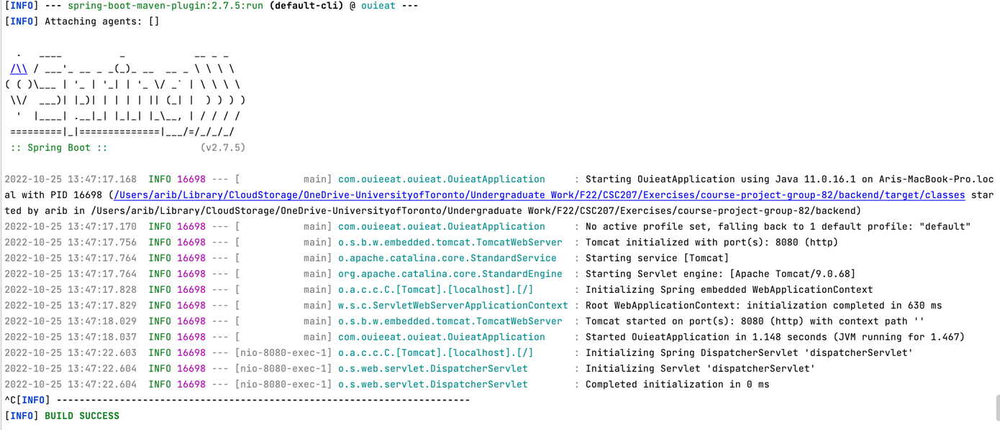

## A Spring REST Backend


### Running

1. Ensure your java version is set to 11 (tested on Azule 11.0.16)
2. Navigate to `src/main/resources/application.properties` and add the key-values for the database connection
   1. If the directory does not exist, then make it
   2. Mark it as a resource directory
   3. Create a new file called `application.properties`
   4. Add the key-value pairs in the discord (Don't push this file to Github, it contains the database access keys which are private)
3. Navigate to the backend folder from a terminal
4. Run the command `./mvnw spring-boot:run` on MacOS or `mvnw spring-boot:run` on Windows
   * Or use your IDE to run it if you can figure it out
5. The API is accessible at http://localhost:8080/ (A test route at [/](http://localhost:8080/))

### Contributing

* Open the backend directory in your IDE (not the root folder) as otherwise your IDE may have trouble downloading the maven dependencies
* Follow the pre-existing naming convention
* This repository is Prettier enforced
* To set it up locally first install the `prettier-plugin-java`
* You can do this either through `yarn` or `npm`
* The installation command for `npm` globally is
    * ```npm install -g prettier prettier-plugin-java```
* To reformat your code
    * `npx prettier --write "**/*.java"` or
    * `prettier --write "**/*.java"`

### Debugging

* An error during the run command is usually due to the wrong java version
* "The Whitelabel error" / "Error handling this Response" means you are missing imports specific to Spring or have misconfigured routes\
* Ensure port 8080 is open for the application
* A sample successful build console output 